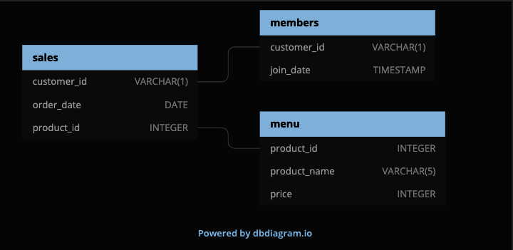
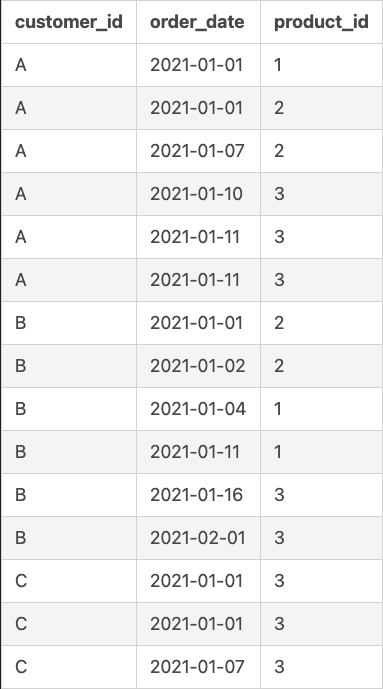
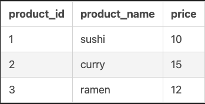
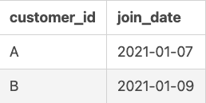

# Case Study 1 - Danny's Diner
https://8weeksqlchallenge.com/case-study-1/


## Introduction
Danny seriously loves Japanese food so in the beginning of 2021, he decides to embark upon a risky venture and opens up a cute little restaurant that sells his 3 favourite foods: sushi, curry and ramen.

Danny’s Diner is in need of your assistance to help the restaurant stay afloat - the restaurant has captured some very basic data from their few months of operation but have no idea how to use their data to help them run the business.


## Problem Statement
Danny wants to use the data to answer a few simple questions about his customers, especially about their visiting patterns, how much money they’ve spent and also which menu items are their favourite. Having this deeper connection with his customers will help him deliver a better and more personalised experience for his loyal customers.

He plans on using these insights to help him decide whether he should expand the existing customer loyalty program - additionally he needs help to generate some basic datasets so his team can easily inspect the data without needing to use SQL.

Danny has provided you with a sample of his overall customer data due to privacy issues - but he hopes that these examples are enough for you to write fully functioning SQL queries to help him answer his questions!

Danny has shared with you 3 key datasets for this case study:
- sales
- menu
- members

You can inspect the entity relationship diagram and example data below.

---
## Entity Relationship Diagram


## Example datasets
### Table 1: sales
The **sales** table captures all **customer_id** level purchases with an corresponding **order_date** and **product_id** information for when and what menu items were ordered.


### Table 2: menu
The **menu** table maps the **product_id** to the actual **product_name** and **price** of each menu item.



### Table 3: members
Table 3: members
The final **members** table captures the **join_date** when a **customer_id** joined the beta version of the Danny’s Diner loyalty program.


---

## Case Study Questions
### Step 1: Join all tables together
```sql
DROP TABLE IF EXISTS sales_and_menu;
CREATE TEMPORARY TABLE sales_and_menu AS
SELECT s.customer_id,
       s.order_date,
       s.product_id,
       m.product_name,
       m.price,
       mem.join_date
FROM sales s
LEFT JOIN menu m
ON s.product_id = m.product_id
LEFT JOIN members mem
ON s.customer_id = mem.customer_id;
```

### Step 2: Answer Questions
1. What is the total amount each customer spent at the restaurant?
```sql
SELECT customer_id,
       SUM(price) AS total_spent
FROM sales_and_menu
GROUP BY customer_id
ORDER BY total_spent DESC;
```
| customer_id   | total_spent |
| -----------   | ----------- |
| A             | 76          |
| B             | 74          |
| C             | 36          |

2. How many days has each customer visited the restaurant?
```sql
SELECT customer_id,
       COUNT (DISTINCT order_date) AS num_visits
FROM sales
GROUP BY customer_id
ORDER BY num_visits DESC
```
| customer_id   | num_visits |
| -----------   | ----------- |
| B             | 6          |
| A             | 4          |
| C             | 2          |


3. What was the first item from the menu purchased by each customer?
```sql
SELECT DISTINCT
       customer_id,
       order_date,
       product_name
FROM sales_and_menu
WHERE order_date = (SELECT MIN(order_date) FROM sales_and_menu)
ORDER BY customer_id
```
| customer_id   | order_date  | product_name
| -----------   | ----------- | -----------
| A             | 2021-01-01  | curry
| A             | 2021-01-01  | sushi
| B             | 2021-01-01  | curry
| C             | 2021-01-01  | ramen


4. What is the most purchased item on the menu and how many times was it purchased by all customers?
```sql
SELECT product_name,
       COUNT(product_name) AS times_purchased
FROM sales_and_menu
GROUP BY product_name
ORDER BY times_purchased DESC
LIMIT 1
```
| product_name      | times_purchased
| -----------       | -----------
| ramen             | 8


5. Which item was the most popular for each customer
```sql
WITH top_orders AS (SELECT customer_id,
                           product_name,
                           COUNT(product_name)
                    FROM sales_and_menu
                    GROUP BY customer_id, product_name),

     orders_ranked AS (SELECT customer_id, product_name, count,
                              RANK () OVER (PARTITION BY customer_id ORDER BY count DESC) AS rank
                              FROM top_orders)
SELECT customer_id, product_name, count
FROM orders_ranked
WHERE rank = 1
```
| customer_id   | product_name  | count
| -----------   | -----------   | -----------
| A             | ramen         | 3
| B             | sushi         | 2
| B             | ramen         | 2
| B             | curry         | 2
| C             | ramen         | 3


6. Which item was purchased first by the customer after they became a member?
```sql
WITH ranked_table AS (SELECT customer_id,
                               order_date,
                               product_id,
                               product_name,
                               join_date,
                               days_between_order,
                               RANK () OVER (PARTITION BY customer_id ORDER BY days_between_order) AS rank
                        FROM (SELECT *, (order_date - join_date) AS days_between_order
                              FROM sales_and_menu
                              WHERE order_date >= join_date
                              ORDER BY customer_id, order_date) t1)
SELECT customer_id, order_date, product_name
FROM ranked_table
WHERE rank=1
```
| customer_id   | order_date    | product_name
| -----------   | -----------   | -----------
| A             | 2021-01-07    | curry
| B             | 2021-01-11    | sushi


7. Which item was purchased just before the customer became a member?
```sql
WITH ranked_table AS (SELECT customer_id,
                               order_date,
                               product_id,
                               product_name,
                               join_date,
                               days_between_order,
                               RANK () OVER (PARTITION BY customer_id ORDER BY days_between_order DESC) AS rank
                        FROM (SELECT *, (order_date - join_date) AS days_between_order
                              FROM sales_and_menu
                              WHERE order_date < join_date
                              ORDER BY customer_id, order_date) t1)
SELECT customer_id, order_date, product_name
FROM ranked_table
WHERE rank=1
```
| customer_id   | order_date    | product_name
| -----------   | -----------   | -----------
| A             | 2021-01-01    | sushi
| A             | 2021-01-01    | curry
| B             | 2021-01-04    | sushi


8. What is the total items and amount spent for each member before they became a member
```sql
SELECT customer_id,
       SUM(price) as total_spent,
       COUNT(DISTINCT product_id) as total_unique_prod
FROM (SELECT *
      FROM sales_and_menu
      WHERE order_date < join_date) t1
GROUP BY customer_id
ORDER BY customer_id
```
| customer_id   | total_spent   | total_unique_prod
| -----------   | -----------   | -----------
| A             | 25            | 2
| B             | 40            | 2


9. If each $1 spent equates to 10 points and sushi has a 2x points multiplier - how many points would each customer have?
```sql
WITH points_table AS (SELECT *,
                             CASE
                                 WHEN product_name = 'sushi' THEN (price*10*2)
                                 ELSE price*10
                             END AS points
                      FROM sales_and_menu)
SELECT customer_id,
       SUM(points) AS total_points
FROM points_table
GROUP BY customer_id
ORDER BY total_points DESC
```
| customer_id   | total_points
| -----------   | -----------
| B             | 940
| A             | 860
| C             | 360

10. In the first week after a customer joins the program (including their join date) they earn 2x points on all items, not just sushi - how many points do customer A and B have at the end of January?
```sql
WITH updated_table AS (SELECT *, (order_date - join_date) AS days_between_order
                        FROM sales_and_menu
                        WHERE customer_id != 'C' AND order_date < '2021-02-01'
                              ORDER BY customer_id, order_date)
SELECT customer_id, SUM(points)
FROM (SELECT *,
        CASE
          WHEN product_name != 'sushi' AND days_between_order < 0 THEN (price*10)
          WHEN product_name != 'sushi' AND days_between_order >= 0 AND days_between_order < 7 THEN (price*10*2)
          WHEN product_name != 'sushi' AND days_between_order >= 0 AND days_between_order >= 7 THEN (price*10)
          ELSE (price*10*2)
        END AS points
      FROM updated_table) t2
GROUP BY customer_id
```


11. BONUS_11: Recreate some tables
```sql
SELECT customer_id, order_date, product_name, price,
         CASE
          WHEN order_date < join_date THEN 'N'
          WHEN order_date >= join_date THEN 'Y'
          ELSE 'N'
        END AS member
FROM sales_and_menu
ORDER BY customer_id, order_date, price DESC
```
| customer_id   | order_date       | product_name | price   | member
| -----------   | ---------        | -----------  | ------- | ---------
| A             | 2021-01-01       | curry        | 15      | N
| A             | 2021-01-01       | sushi        | 10      | N
| A             | 2021-01-07       | curry        | 15      | Y
| A             | 2021-01-10       | ramen        | 12      | Y
| A             | 2021-01-11       | ramen        | 12      | Y
| A             | 2021-01-11       | ramen        | 12      | Y
| B             | 2021-01-01       | curry        | 15      | N
| B             | 2021-01-02       | curry        | 15      | N
| B             | 2021-01-04       | sushi        | 10      | N
| B             | 2021-01-11       | sushi        | 10      | Y
| B             | 2021-01-16       | ramen        | 12      | Y
| B             | 2021-02-01       | ramen        | 12      | Y
| C             | 2021-01-01       | ramen        | 12      | N
| C             | 2021-01-01       | ramen        | 12      | N
| C             | 2021-01-07       | ramen        | 12      | N


11. BONUS_12: Recreate some tables
```sql
WITH new_table AS (SELECT customer_id, order_date, product_name, price,
                   CASE
                     WHEN order_date < join_date THEN 'N'
                     WHEN order_date >= join_date THEN 'Y'
                      ELSE 'N'
                      END AS member
                    FROM sales_and_menu
                    ORDER BY customer_id, order_date, price DESC)
SELECT customer_id,
         order_date,
         product_name,
         price,
         member,
         CASE
            WHEN member = 'N' THEN NULL
         ELSE RANK () OVER (
            PARTITION BY customer_id,member ORDER BY order_date
          )
         END AS ranking
  FROM new_table
```
| customer_id   | order_date       | product_name | price   | member   | ranking
| -----------   | ---------        | -----------  | ------- | -------- | -------
| A             | 2021-01-01       | curry        | 15      | N        | null
| A             | 2021-01-01       | sushi        | 10      | N        | null
| A             | 2021-01-07       | curry        | 15      | Y        | 1
| A             | 2021-01-10       | ramen        | 12      | Y        | 2
| A             | 2021-01-11       | ramen        | 12      | Y        | 3
| A             | 2021-01-11       | ramen        | 12      | Y        | 3
| B             | 2021-01-01       | curry        | 15      | N        | null
| B             | 2021-01-02       | curry        | 15      | N        | null
| B             | 2021-01-04       | sushi        | 10      | N        | null
| B             | 2021-01-11       | sushi        | 10      | Y        | 1
| B             | 2021-01-16       | ramen        | 12      | Y        | 2
| B             | 2021-02-01       | ramen        | 12      | Y        | 3
| C             | 2021-01-01       | ramen        | 12      | N        | null
| C             | 2021-01-01       | ramen        | 12      | N        | null
| C             | 2021-01-07       | ramen        | 12      | N        | null
