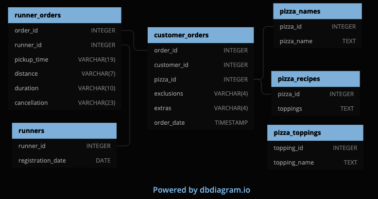
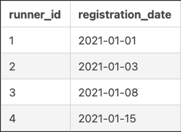
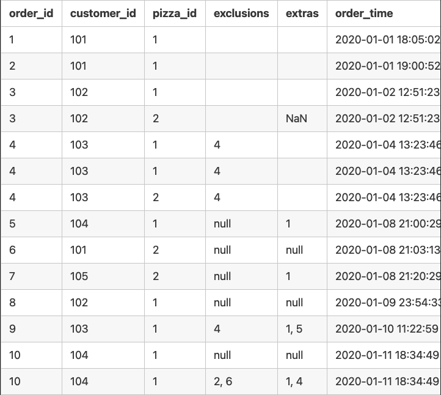
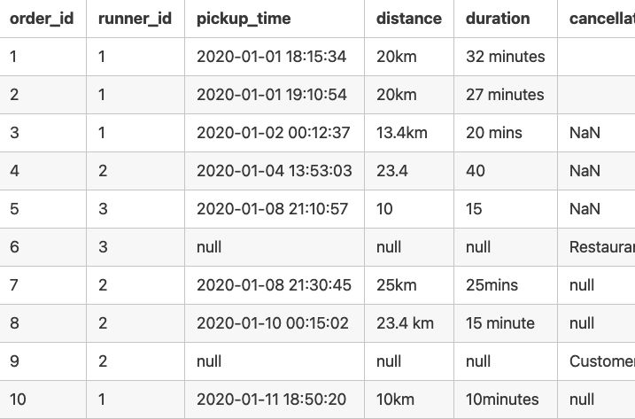
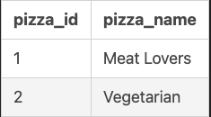
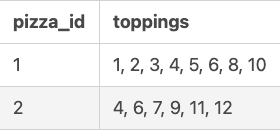
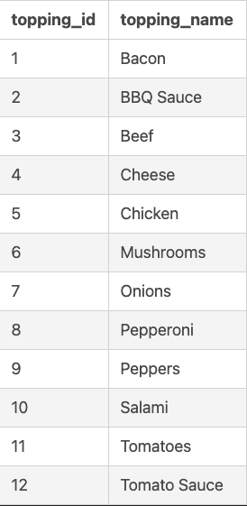

# Case Study 1 - Pizza Runner
https://8weeksqlchallenge.com/case-study-2/


## Introduction
Did you know that over 115 million kilograms of pizza is consumed daily worldwide??? (Well according to Wikipedia anyway…)

Danny was scrolling through his Instagram feed when something really caught his eye - “80s Retro Styling and Pizza Is The Future!”

Danny was sold on the idea, but he knew that pizza alone was not going to help him get seed funding to expand his new Pizza Empire - so he had one more genius idea to combine with it - he was going to Uberize it - and so Pizza Runner was launched!

Danny started by recruiting “runners” to deliver fresh pizza from Pizza Runner Headquarters (otherwise known as Danny’s house) and also maxed out his credit card to pay freelance developers to build a mobile app to accept orders from customers.


## Available Data
Because Danny had a few years of experience as a data scientist - he was very aware that data collection was going to be critical for his business’ growth.

He has prepared for us an entity relationship diagram of his database design but requires further assistance to clean his data and apply some basic calculations so he can better direct his runners and optimise Pizza Runner’s operations.

---
## Entity Relationship Diagram


## Datasets
### Table 1: runners
The **runners** table shows the **registration_date** for each new runner


### Table 2: customer_orders
Customer pizza orders are captured in the **customer_orders** table with 1 row for each individual pizza that is part of the order.

The **pizza_id** relates to the type of pizza which was ordered whilst the **exclusions** are the **ingredient_id** values which should be removed from the pizza and the **extras** are the **ingredient_id** values which need to be added to the pizza.

Note that customers can order multiple pizzas in a single order with varying **exclusions** and **extras** values even if the pizza is the same type!

The **exclusions** and **extras** columns will need to be cleaned up before using them in your queries.


### Table 3: runner_orders
After each orders are received through the system - they are assigned to a runner - however not all orders are fully completed and can be cancelled by the restaurant or the customer.

The **pickup_time** is the timestamp at which the runner arrives at the Pizza Runner headquarters to pick up the freshly cooked pizzas. The **distance** and **duration** fields are related to how far and long the runner had to travel to deliver the order to the respective customer.

There are some known data issues with this table so be careful when using this in your queries - make sure to check the data types for each column in the schema SQL!


### Table 4: pizza_names
At the moment - Pizza Runner only has 2 pizzas available the Meat Lovers or Vegetarian!


### Table 5: pizza_recipes
Each **pizza_id** has a standard set of **toppings** which are used as part of the pizza recipe.


### Table 6: pizza_toppings
This table contains all of the **topping_name** values with their corresponding **topping_id** value



---
## Case Study Questions
This case study has LOTS of questions - they are broken up by area of focus including:

Pizza Metrics
Runner and Customer Experience
Ingredient Optimisation
Pricing and Ratings
Bonus DML Challenges (DML = Data Manipulation Language)
Each of the following case study questions can be answered using a single SQL statement.

Again, there are many questions in this case study - please feel free to pick and choose which ones you’d like to try!

Before you start writing your SQL queries however - you might want to investigate the data, you may want to do something with some of those **null** values and data types in the **customer_orders** and **runner_orders** tables!

---
### Cleaning
1. Clean **customer_orders** tables
```sql
DROP TABLE IF EXISTS customer_orders_clean;
CREATE TABLE customer_orders_clean AS
  SELECT order_id,
         customer_id,
         pizza_id,
  --     exclusions,
         CASE
              WHEN exclusions = '' THEN NULL
              WHEN exclusions = 'null' THEN NULL
              ELSE exclusions END AS exclusions,
  --     extras,
         CASE
              WHEN extras = '' THEN NULL
              WHEN extras = 'null' THEN NULL
              ELSE extras END AS extras,
         order_time
  FROM customer_orders
```

2. Clean **runner_orders** table
```sql
DROP TABLE IF EXISTS runner_orders_clean;
CREATE TABLE runner_orders_clean AS
  SELECT order_id,
         runner_id,
  --     pickup_time,
         CASE
              WHEN pickup_time = '' THEN NULL
              WHEN pickup_time = 'null' THEN NULL
              ELSE pickup_time END AS pickup_time,
  --     distance,
         CASE
              WHEN distance = '' THEN NULL
              WHEN distance = 'null' THEN NULL
              ELSE CAST ((regexp_replace(distance, '[a-z]+', '' )) AS DECIMAL) END AS distance,
  --     duration
         CASE
              WHEN duration = '' THEN NULL
              WHEN duration = 'null' THEN NULL
              ELSE CAST ((regexp_replace(duration, '[a-z]+', '' )) AS DECIMAL) END AS duration,
  --     cancellation
         CASE
              WHEN cancellation = '' THEN NULL
              WHEN cancellation = 'null' THEN NULL
              ELSE cancellation END AS cancellation
  FROM runner_orders;
  ```
---
## Pizza Metrics
1. How many pizzas were ordered?
```sql
SELECT COUNT(order_id)
FROM customer_orders_clean
```


2. How many unique customer orders were made?
```sql
SELECT COUNT(DISTINCT order_id)
FROM customer_orders_clean
```


3. How many successful orders were delivered by each runner?
```sql
SELECT COUNT(*)
FROM runner_orders_clean
WHERE cancellation IS NULL
```


4. How many of each type of pizza was delivered?
```sql
SELECT pizza_id, COUNT(*)
FROM customer_orders_clean
GROUP BY pizza_id
```


5. How many Vegetarian and Meatlovers were ordered by each customer?
```sql
SELECT customer_id, pizza_id, COUNT(*)
FROM customer_orders_clean
GROUP BY customer_id, pizza_id
```

6. What was the maximum number of pizzas delivered in a single order?
```sql
SELECT c.order_id, COUNT(c.pizza_id)
FROM customer_orders_clean c
LEFT JOIN runner_orders_clean r
ON c.order_id = r.order_id
WHERE cancellation IS NULL
GROUP BY c.order_id
ORDER BY count DESC
```

7. For each customer, how many delivered pizzas had at least 1 change and how many had no changes?
```sql
WITH check_null AS (SELECT *,
                             CASE
                                 WHEN (exclusions IS NULL AND extras IS NULL) THEN 'no change'
                                 ELSE 'change' END AS changes
                      FROM customer_orders_clean c
                      LEFT JOIN runner_orders_clean r
                      ON c.order_id = r.order_id
                      WHERE cancellation IS NULL);
SELECT customer_id, changes, COUNT(*)
FROM check_null
GROUP BY customer_id, changes
ORDER BY customer_id;
```

8. How many pizzas were delivered that had both exclusions and extras?
```sql
WITH check_null AS (SELECT *,
                             CASE
                                 WHEN (exclusions IS NULL AND extras IS NULL) THEN 'no change'
                                 ELSE 'change' END AS changes
                      FROM customer_orders_clean c
                      LEFT JOIN runner_orders_clean r
                      ON c.order_id = r.order_id
                      WHERE cancellation IS NULL)
SELECT COUNT(*)
FROM check_null
WHERE exclusions IS NOT NULL AND extras IS NOT NULL;
```

9. What was the total volume of pizzas ordered for each hour of the day?
```sql
WITH hour_day AS (SELECT EXTRACT(hour FROM order_time) AS hour_of_day
                  FROM customer_orders_clean)
SELECT hour_of_day, COUNT(*)
FROM hour_day
GROUP BY hour_of_day
ORDER BY hour_of_day;
```

10. What was the volume of orders for each day of the week?
```sql
WITH dow AS (SELECT EXTRACT(isodow FROM order_time) AS dow
                  FROM customer_orders_clean)
SELECT dow, COUNT(*)
FROM dow
GROUP BY dow
ORDER BY dow
```
---
## Runner and Customer Experience
1. How many runners signed up for each 1 week period? **(i.e. week starts 2021-01-01)**
**mistake here**
```sql
SELECT runner_id,
       registration_date,
       DATE_PART('week', registration_date) AS reg_week
FROM runners
```

2. What was the average time in minutes it took for each runner to arrive at the Pizza Runner HQ to pickup the order?
**check if there's a mistake for order_id #3**
```sql
WITH time_tab AS (SELECT DISTINCT r.order_id,
                         r.runner_id,
                         TO_TIMESTAMP(r.pickup_time,'YYYY-MM-DD HH24:MI:SS') AS pickup_time,
                         r.distance,
                         r.duration,
                         r.cancellation,
                         c.order_time
                  FROM runner_orders_clean r
                  INNER JOIN customer_orders_clean c
                  ON r.order_id = c.order_id)
SELECT order_id,
       order_time,
       pickup_time,
       (EXTRACT(EPOCH FROM (pickup_time-order_time))/60) AS difference
FROM time_tab
WHERE pickup_time IS NOT NULL
```


3. Is there any relationship between the number of pizzas and how long the order takes to prepare?

4. What was the average distance travelled for each customer?
```sql
WITH cust_dist AS (SELECT DISTINCT r.order_id,
                                   r.runner_id,
                                   r.distance,
                                   c.customer_id
                            FROM runner_orders_clean r
                            INNER JOIN customer_orders_clean c
                            ON r.order_id = c.order_id
                            WHERE r.distance IS NOT NULL AND r.cancellation IS NULL
                            ORDER BY customer_id)
SELECT customer_id, ROUND(AVG(distance),1)
FROM cust_dist
GROUP BY customer_id
```

5. What was the difference between the longest and shortest delivery times for all orders?
```sql
SELECT MAX(duration) - MIN(duration) AS max_delivery_time
FROM runner_orders_clean
WHERE cancellation IS NULL
```

6. What was the average speed for each runner for each delivery and do you notice any trend for these values?
```sql
WITH speed_tab AS (SELECT runner_id, distance, duration, ROUND((distance/duration)*60,2) AS km_per_hr
                    FROM runner_orders_clean
                    WHERE cancellation IS NULL)
SELECT runner_id, ROUND(AVG(km_per_hr),2) AS avg_km_per_hr
FROM speed_tab
GROUP BY runner_id
```

7. What is the successful delivery percentage for each runner?
```sql
SELECT runner_id,
       COUNT(*) AS all_deliveries,
       COUNT(pickup_time) AS successful_deliv,
       ROUND((COUNT(pickup_time)::NUMERIC/COUNT(*))*100,2) AS succ_deliv_perc
FROM runner_orders_clean
GROUP BY runner_id
```

---
## Ingredient Optimisation

1. What are the standard ingredients for each pizza?
2. What was the most commonly added extra?
3. What was the most common exclusion?
4. Generate an order item for each record in the customers_orders table in the format of one of the following:
- **Meat Lovers**
- **Meat Lovers - Exclude Beef**
- **Meat Lovers - Extra Bacon**
- **Meat Lovers - Exclude Cheese, Bacon - Extra Mushroom, Peppers**
5. Generate an alphabetically ordered comma separated ingredient list for each pizza order from the customer_orders table and add a 2x in front of any relevant ingredients
- **For example: "Meat Lovers: 2xBacon, Beef, ... , Salami"**
6. What is the total quantity of each ingredient used in all delivered pizzas sorted by most frequent first?
